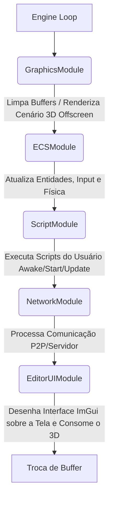
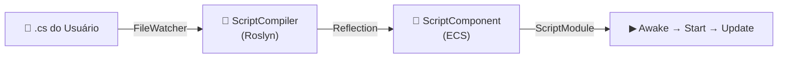

# Arquitetura ERus Engine

A **ERus Engine** é baseada em um modelo puramente **Modular (Plugin System)** combinado com o poderoso paradigma **Entity Component System (ECS)**. A engine é construída em **C# (.NET 10)** e utiliza as bibliotecas nativas do pacote **Silk.NET** para comunicação com o Sistema Operacional (Janela e Input) e para renderização via OpenGL, com interface em ImGui.

> [!NOTE]
> Essa arquitetura foi desenhada para permitir que desenvolvedores injetem, troquem ou desabilitem partes da engine sem precisar modificar o núcleo (Core).

---

## 1. O Núcleo (Core)

A estrutura base da engine não toma nenhuma decisão gráfica ou lógica em si. Ela serve estritamente como uma orquestradora.

- `Engine.cs`: O coração da engine, instanciado como um Singleton. Sua responsabilidade é criar a janela do Silk.NET (`IWindow`), interceptar eventos do Sistema Operacional (como redimensionamento, DPI scaling) e executar o *Game Loop*. Ele armazena uma lista de `IEngineModule` e propaga os eventos de `Update(deltaTime)` e `Render(deltaTime)` para eles sequencialmente. O `Engine.cs` também soluciona bugs nativos de DPI do Windows capturando a resolução real de pixels no evento `FramebufferResize`.
- `IEngineModule.cs`: Interface base (contrato) que todo sistema principal da engine deve assinar. Define os métodos `Initialize`, `Update`, `Render` e `Dispose`.

### A Pipeline de Execução (Ordem dos Módulos)

---

## 2. A Camada Gráfica (Graphics)

A ERus utiliza **OpenGL** via Silk.NET para renderização gráfica e adota a técnica de **Offscreen Rendering** para possibilitar que a cena seja exibida *dentro* de uma aba do editor, sem preencher a tela inteira.

- `GraphicsModule.cs`: Primeiro módulo a rodar. Limpa a janela principal com uma cor sólida de fundo, instancia os objetos FBO (Framebuffer Object) e chama os renderizadores da Cena. Este módulo disponibiliza o ID da textura renderizada para que a interface a desenhe depois.
- `Framebuffer.cs` (`GLFramebuffer`): Encapsula as regras de memória da Placa de Vídeo. Cria uma textura (Color Attachment) invisível e um Renderbuffer (Depth Attachment). A classe possui um método `Invalidate(width, height)` que permite destruir e reconstruir a memória sempre que o usuário estica ou encolhe o painel do editor.
- `SceneRenderer.cs`: Responsável por subir a geometria (VBO/VAO) e compilar os Shaders na VRAM. Atualmente executa um "Hello Triangle" desenhando primitivas estáticas na tela.

---

## 3. Interface e Editor (EditorUI)

A interface de usuário é orientada pelo paradigma *Immediate Mode GUI* (Dear ImGui). A UI adota um **Layout Absoluto Matemático**, recusando o gerenciamento padrão do `imgui.ini` para garantir que os painéis cubram totalmente a resolução nativa da tela sem distorções de escala do Windows.

- `EditorUIModule.cs`: Último módulo da pipeline. Simplesmente invoca a inicialização e os ciclos do Controlador Central do ImGui.
- `EditorUIController.cs`: O "cérebro" das telas. Injeta o tamanho físico em pixels nativos (`Engine.CurrentSize`) no ImGui e faz os cálculos matemáticos precisos (usando Splitters Invisíveis) para posicionar cada janela na tela (Esquerda, Direita, Meio, Base). Todos os tamanhos de painel são empurrados com a flag `ImGuiCond.Always`.
- `EditorWindow.cs`: Classe base abstrata para painéis da Interface. Define o método `DrawRawContent` que lida virtualmente com o ciclo da janela.
- **Painéis (Scripts Derivados)**:
  - `SceneViewWindow.cs`: O painel principal do meio. Conecta-se com a instância de `GraphicsModule` para ler e exibir a textura Offscreen do OpenGL usando `ImGui.Image`.
  - `HierarchyWindow.cs`: Painel lateral esquerdo (Listagem das entidades instanciadas na fase atual).
  - `InspectorWindow.cs`: Painel lateral direito (Visão técnica das variáveis e componentes da Entidade selecionada). Exibe e permite atribuir/remover scripts via dropdown.
  - `ProjectWindow.cs` & `ConsoleWindow.cs`: Abas em formato "Tab" aglomeradas no contêiner inferior. A ConsoleWindow exibe logs do sistema de scripting com cores por nível (Info/Warning/Error).

---

## 4. Entity Component System (ECS)

O modelo arquitetural para a lógica do jogo (Data-Oriented Design).

- `Entity.cs`: Entidades não são objetos com memória. São representadas unicamente como números inteiros (ID único).
- `ComponentArray.cs` / `IComponentArray.cs`: Estruturas de Arrays contíguos na RAM que armazenam as `Structs` (Componentes). O processador os varre sequencialmente garantindo o melhor *Cache-Hit* e otimização de CPU possível.
- `Registry.cs`: A classe global gestora de dados. Gerencia a criação, descarte e atribuição de Componentes para as Entidades.
- `SystemBase.cs`: A lógica de fato. Sistemas percorrem os Arrays e executam mutações matemáticas.
- `ECSModule.cs`: O módulo de pipeline que gerencia e pulsa a atualização (Update) dos Sistemas.
- `ScriptComponent.cs`: Componente struct que marca uma entidade como portadora de um script de gameplay. Armazena o nome do tipo do script.

---

## 5. Sistema de Scripting (Scripts)

Sistema de compilação C# em runtime que permite ao usuário escrever scripts de gameplay sem modificar o código da engine.

- `ERusScript.cs`: Classe base abstrata que todo script do usuário herda. Define o ciclo de vida: `Awake()` → `Start()` → `Update()` → `OnDestroy()`. Oferece propriedades injetadas (`Entity`, `Registry`, `Engine`, `DeltaTime`) e atalhos (`Transform`, `Log()`).
- `ScriptCompiler.cs`: Compila arquivos `.cs` da pasta `Assets/Scripts/` em assemblies na memória via **Roslyn** (Microsoft.CodeAnalysis.CSharp). Usa `AssemblyLoadContext` isolado (collectible) para permitir unload/reload sem reiniciar a engine.
- `ConsoleLog.cs`: Log centralizado thread-safe. Scripts do usuário e o compilador escrevem aqui; a `ConsoleWindow` lê e exibe com cores.
- `ScriptModule.cs`: Módulo da pipeline (posição 3, entre ECS e Network). Responsabilidades:
  1. Compila todos os `.cs` de `Assets/Scripts/` via Roslyn no `Initialize`
  2. Monitora mudanças via `FileSystemWatcher` para hot-reload automático
  3. Instancia `ERusScript` para entidades com `ScriptComponent` ao entrar em Play
  4. Propaga callbacks `Awake` → `Start` → `Update` → `OnDestroy`
  5. Destrói todas as instâncias quando o Play termina (Stop)

### Fluxo de um Script

---

## 6. Módulo de Rede (Network)

Sistema construído focado no tráfego em tempo real para Multiplayer/Co-op de desenvolvimento.

- `NetworkModule.cs` (e derivados `NetworkManager`): Utiliza a biblioteca `LiteNetLib` rodando em User Datagram Protocol (UDP). 
Os dados são acumulados durante os quadros normais, despachados e extraídos sem interromper o Main Thread até que o Módulo seja invocado. No momento a base de conexão é P2P Host.

