```mermaid
timeline
    title Linha do Tempo de Evolução da ERus Engine
    section 2026
        v0.5.21 (Concluído) : Co-edição ao vivo : Hub Remote Sharing : Server Health Monitor
        v0.5.30 (Concluído) : Materiais, Texturas & Sprites 2D : Drag & Drop de Imagens : PBR Básico : Asset GUID
        v0.5.35 : Segurança de Sessão : Token de Handshake : Limpeza de Locks Órfãos
        v0.5.40 : Canvas 2D & UI de Gameplay : UIImage, UIText, UIButton : Âncoras
        v0.5.50 : Iluminação, Sombras & Ambiente : Render Passes : Luzes, Shadow Mapping, Neblina 3D : Profiler Mínimo
        v0.5.55 : Prefabs, Scene Management & Componentes : CharacterController, LoadScene, Billboard
        v0.5.60 : Gameplay & Físicas em C# : OnCollision / OnTrigger : Raycasting C#
        v0.5.70 : Animator Controller & Animações : State Machine & Cross-Fade : Grafo Visual
        v0.5.80 : Áudio 3D Espacial : AudioSource & Listener : Efeitos e Música
        v0.5.90 : Templates de Script & Onboarding : Create C# Script comentado : Aba Learn no Hub
        v0.6.00 : Resiliência de Rede : Handlers Modulares : Host Migration : Fallback de Sessão
        v0.6.50 : Project Settings & Preferences : Player, Física, Gráficos : Tags & Layers
        v0.7.00 : Standalone Game Builder : Templates de Projetos no Hub : Exportador .exe
        v0.7.50 : Documentação Integrada & API Reference : Janela Help no Editor
        v0.8.00 : Profiler Avançado & Diagnósticos : Draw Calls & GC : Frustum Culling : Delta Compression
        v0.8.50 : Post-Processing & Efeitos Visuais : Bloom, SSAO, Color Grading : Vignette
        v0.9.00 : Asset Bundling (.pak) & Multiplataforma : Criptografia de Assets : Windows & Linux
        v0.9.20 : NavMesh & Pathfinding de IA : NavAgent, Obstacle Avoidance : Navegação Automática
        v0.9.50 : AI-Native Engine : Servidor MCP Integrado : Automação por IA
        v1.0.00 : Gold Release Oficial : Produção Comercial Completa
```

# 🗺️ Roadmap de Versões da ERus Engine

Este documento define a linha do tempo estratégica e o escopo de funcionalidades planejadas para a evolução da **ERus Engine & Editor**, partindo da versão atual até o lançamento da **v1.0.0 (Gold Release)**.

> ⚠️ **Nota sobre prazos:** as versões abaixo representam ordem de dependência e escopo, não um cronograma fixo. Cada marco listado equivale, historicamente, a meses de trabalho em engines maduras com equipes maiores — os prazos devem ser tratados como direção, não compromisso.

---

---

## 📦 Detalhamento dos Marcos de Versão

### 🟢 **v0.5.21 (Concluído)**
- ✅ **Rede 2.0 & Co-Criação:** Sincronização de arrasto de gizmo em tempo real, presença de desenvolvedores, bounding boxes coloridas e team chat integrado.
- ✅ **Hub Remote Sharing:** Publicação de projetos locais no servidor remoto e convite imediato de membros da equipe.
- ✅ **Server Health Monitor:** Medição assíncrona de Ping e indicadores visuais de status dos servidores remotos.
- ✅ **Undo/Redo (`UndoSystem`):** Pilha de comandos reversíveis (`IUndoCommand`) com `Ctrl+Z` / `Ctrl+Shift+Z`, cobrindo transform, edição de propriedades no Inspector e ciclo de vida de entidades, com replicação de rede no desfazer.
- ✅ **Inspector Modular:** `InspectorWindow` decomposto em drawers por componente (`IComponentDrawer` + `ComponentDrawerRegistry`); adicionar um componente novo ao Inspector não exige mais tocar no painel.
- ⚠️ **Risco conhecido:** topologia P2P ainda sem host migration — endereçado explicitamente em **v0.6.00**.

---

### 🟢 **v0.5.30: Materiais, Texturas & Sprites 2D** *(concluído)*
- ✅ **`MaterialComponent` no Inspector:** Cor Base (Color Tint), slot de Albedo Texture, Tiling e Offset, Metallic, Roughness e Alpha Cutoff com `MaterialDrawer` modular e suporte a Undo/Redo.
- ✅ **Drag-and-Drop de Imagens:** Arrastar arquivos `.png`/`.jpg` da janela *Project* diretamente para slots de material, Hierarchy e viewport 3D (geração de Sprite/Quad).
- ✅ **Miniaturas e Preview:** Visualização em Grade (Grid/Tiles) e Lista com miniaturas de imagens, slider de zoom (48px a 128px), barra de busca e ícones temáticos por tipo de arquivo no *ProjectWindow*.
- ✅ **Sincronização de Texturas:** Replicação automática de novos arquivos de imagem para parceiros conectados na rede via TCP (`AssetSync` + anúncio de hash).
- ✅ **Formato de Referência de Asset:** Esquema de GUID estável por asset com metadados `.meta`, detecção de integridade por hash SHA256 e resolução consistente em `AssetDatabase`.
- ✅ **Correção de ID de Rede Único:** Substituição do `Random.Next(1, 1000)` no `NetworkTransport` por identificador estável derivado de `Guid`, eliminando o risco crítico de colisão de usuários e locks fantasma.
- ✅ **Estratégia de Rede:** texturas sincronizam via canal de asset (TCP) já existente com preview/thumbnail gerado localmente sob demanda pela GPU.

---

### 🔐 **v0.5.35: Segurança de Sessão & Locks Órfãos**
*(desmembrado de v0.6.00 — a superfície de ataque já está aberta desde que o Hub Remote Sharing entrou em v0.5.21; adiar por oito marcos não é aceitável)*
- 🔑 **Token de Handshake:** substituição da chave global fixa `"ERusKeys"` (`NetworkTransport.InitializeAsClient` / `OnConnectionRequest`) por token de sessão temporário ou senha de projeto, fechando a porta para conexões não autorizadas e comandos de destruição arbitrários.
- 🔓 **Liberação Automática de Locks Órfãos:** no evento `OnPeerDisconnected`, o Host destrava e limpa todas as entidades bloqueadas (`LockUserId`) pelo usuário que caiu. Hoje um cliente que perde a conexão trava a edição daquela entidade para todos os demais até o fim da sessão.
- 🧪 **Teste de Regressão:** cenário automatizado de cliente derrubado no meio de um lock, validando que a entidade volta a ser editável.

> Os itens restantes de rede (host migration, reconexão automática, RTT) permanecem em **v0.6.00** — este marco cobre apenas o que já é explorável hoje.

---

### 🔲 **v0.5.40: Canvas 2D & Sistema de UI de Gameplay**
- 📐 **`CanvasComponent`:** Gerenciador de resolução, escala adaptativa (*Screen Space Overlay* e *World Space*).
- 🖼️ **`UIImageComponent`:** Exibição de texturas e sprites 2D para barras de vida, miras, ícones e inventários.
- 🔤 **`UITextComponent`:** Renderização de fontes TrueType (`.ttf`/SDF) com cores, alinhamentos e sombras.
- 🔘 **`UIButtonComponent`:** Botões interativos com estados *Normal*, *Hover*, *Pressed* e eventos de clique (`OnClick`).
- 📌 **Sistema de Âncoras:** Posicionamento relativo (Top-Left, Center, Stretch, Bottom-Right) responsivo a qualquer resolução.
- 🌐 **Estratégia de Rede:** decidir se estado de UI (ex: texto de um `UIText` alterado por script) é replicado em tempo real entre colaboradores ou é local-only por padrão.

---

### 💡 **v0.5.50: Iluminação, Sombras & Ambiente**
- 🧱 **Pré-requisito — Refatorar o `SceneRenderer` em Render Passes:**
  - O renderer atual concentra três pipelines de shader (primitivas/sprites, modelos Assimp com skinning, linhas de grid/wireframe) em uma classe de ~600 linhas com 37 campos, GLSL embutido como string literal e dois métodos de ~210 linhas (`Initialize` e `Draw`).
  - Extrair uma abstração `ShaderProgram` (compilação + cache de uniform locations), separar em passes (`MeshPass`, `ModelPass`, `DebugLinePass`) e mover o GLSL para arquivos `.vert`/`.frag` embutidos.
  - **Sem isso, adicionar luzes, shadow maps e fog significa empilhar mais um pipeline dentro da mesma classe.** O custo de fazer depois é maior que o de fazer antes.
- 📊 **Profiler Mínimo (antecipado de v0.8.00):**
  - Overlay de frametime (CPU ms / GPU ms) e contador de Draw Calls.
  - Motivo da antecipação: profiler é ferramenta de decisão, não de encerramento. Iluminação e sombras são o ponto onde o custo de render começa a crescer — medir depois de construir tudo às cegas inverte a ordem útil.
- 💡 **Sistema de Iluminação 3D:**
  - `LightComponent` com suporte a **Directional Light** (Sol), **Point Light** (Lâmpada/Tocha) e **Spot Light** (Lanterna) com cor, intensidade e atenuação de raio.
- 🌑 **Shadow Mapping:**
  - Sombras em tempo real para a **Directional Light** (cascaded shadow maps ou shadow map básico).
  - Sombras opcionais para **Point Lights** e **Spot Lights** (depth cubemap).
  - Configuração de resolução, bias e distância máxima de sombras no Inspector.
- 🌫️ **Ambiente, Neblina & Efeitos:**
  - `SkyboxComponent` / `EnvironmentComponent` (fundo com gradiente ou cubemap 360°).
  - `FogComponent` / **Neblina Atmosférica 3D** (Distance Fog linear e exponencial com cor e densidade ajustáveis para profundidade de cena).
  - `ParticleEmitterComponent` (sistema básico de partículas para fogo, fumaça, faíscas e poeira).
- 📦 **Menu de Criação Rápida & Add Component:**
  - Menu `GameObject -> Light / Effects / 3D Object` com objetos pré-configurados prontos.
  - Janela de busca *"Add Component"* com categorias organizadas no Inspector.
- 🌐 **Estratégia de Rede:** propriedades de luz/neblina editadas ao vivo entram no mesmo canal de Temporal Locking do Transform, ou ficam fora do live-sync e só sincronizam no save?

---

### 🧱 **v0.5.55: Prefabs, Scene Management & Componentes de Gameplay**
- 🧱 **Sistema de Prefabs Reutilizáveis (`.prefab`):**
  - Salvar qualquer entidade com seus filhos e componentes configurados como um arquivo `.prefab` no navegador de arquivos.
  - Arrastar prefabs do navegador direto para a cena ou instanciar via script C# (`Instantiate("Player.prefab", position)`).
  - Usa o esquema de Asset GUID definido em v0.5.30 como referência estável do prefab.
- 🗺️ **Scene Management (Gerenciamento de Cenas):**
  - `SceneManager.LoadScene("Level2")` — carregamento síncrono de cenas (troca de fase imediata).
  - `SceneManager.LoadSceneAsync("Level2")` — carregamento assíncrono com callback de progresso para telas de loading.
  - **Cenas Aditivas:** carregar múltiplas cenas simultaneamente (ex: mundo 3D + HUD de UI sobrepostos como cenas separadas).
- 🏃‍♂️ **Novos Componentes de Gameplay:**
  - `CharacterControllerComponent` (controlador de movimentação com detecção suave de degraus, inclinação e solo sem deslize físico indesejado).
  - `BillboardComponent` (sprites/ícones 2D que sempre se alinham de frente para a câmera).
  - `CameraFollowComponent` (câmera orbital suave de terceira pessoa com distância ajustável).
- 🌐 **Estratégia de Rede:** instanciação de prefab via `Instantiate()` em runtime precisa propagar para colaboradores/clientes conectados — definir protocolo de spawn replicado antes de v0.5.60 depender disso.

---

### 💥 **v0.5.60: Gameplay & Físicas em C#**
- 🧩 **Pré-requisito de decisão:** confirmar/documentar qual motor de física está por baixo (custom, Bepu, Jitter, etc.) antes de iniciar — `AddForce`, `AddImpulse` e `Raycast` dependem diretamente dessa escolha.
- ⚡ **Callbacks de Colisão nos Scripts:** `OnCollisionEnter`, `OnCollisionExit`, `OnTriggerEnter`, `OnTriggerExit` automáticos em classes `ERusScript`.
- 🎯 **Raycasting em C#:** `Physics.Raycast(ray, out hitInfo, maxDistance)` acessível diretamente nos scripts.
- 🕹️ **Manipulação Dinâmica:** Métodos de física (`AddForce`, `AddImpulse`, controle de velocidade linear/angular).
- 🌐 **Estratégia de Rede:** simulação física roda em todos os peers (determinística) ou só no host/autoridade, com correção de estado nos clientes?

---

### 🎬 **v0.5.70: Animator Controller & Sistema Avançado de Animações**
- 🧠 **Máquina de Estados de Animação (Estilo Mecanim):**
  - **Parâmetros de Animação:** `SetFloat`, `SetBool`, `SetTrigger` e `SetInt` para controle direto via script.
  - **Transições com Cross-Fade:** Mesclagem suave de poses (*pose blending*) entre animações sem cortes secos (ex: transição suave de 0.2s de *Idle* para *Run*).
  - **Layers de Animação & Masking:** Suporte a camadas (ex: tocar animação de *Recarregar* apenas na parte superior do corpo enquanto o personagem corre).
- 🎛️ **Janela de Grafo de Animações no Editor (`Animator Window`):**
  - Editor visual baseado em nós com criação de estados, conexões e setas de transição interativas no ImGui.
- 🔔 **Animation Events:**
  - Disparo de eventos e métodos C# em frames específicos da animação.
- 🌐 **Estratégia de Rede:** parâmetros do Animator (`SetTrigger`, etc.) precisam replicar para que outros clientes vejam a mesma animação — definir se via RPC leve ou snapshot de estado.

---

### 🔊 **v0.5.80: Sistema de Áudio 3D Espacial**
- 🎧 **Componentes de Som:** `AudioSourceComponent` e `AudioListenerComponent`.
- 🎵 **Formatos Suportados:** Decodificação e reprodução de `.wav`, `.ogg` e `.mp3`.
- 🌐 **Atenuação Espacial:** Atenuação de volume por distância 3D (*Spatial Blend* 2D/3D, curvas de atenuação).
- 📜 **API de Áudio nos Scripts:** `audioSource.Play()`, `Pause()`, `PlayOneShot(clip)`.
- 🌐 **Estratégia de Rede:** `PlayOneShot` disparado por script replica como evento (RPC) para outros clientes ouvirem o mesmo som, ou é local-only por padrão?

---

### 📝 **v0.5.90: Templates de Script & Onboarding**
*(a API Reference completa foi movida para v0.7.50 — documentar antes de Project Settings e do Builder estabilizarem a superfície pública gera manutenção dupla. Os itens baratos e independentes ficam aqui.)*
- 📝 **Templates Inteligentes de Scripts C#:**
  - Ao clicar em `Create -> C# Script` no navegador de arquivos, o arquivo gerado já vem com exemplos comentados de movimentação, leitura de input, detecção de colisões e busca de componentes.
- 🌐 **Aba "Learn / Documentação" no ERus Hub:**
  - Seção dedicada no launcher com guias de início rápido, manuais em Markdown e links diretos para a documentação offline da engine.

---

### 🌐 **v0.6.00: Resiliência de Rede, Topologia & Fallback**
*(endereça os riscos de estabilidade e topologia P2P; a parte de segurança explorável hoje foi antecipada para **v0.5.35**)*
- 🧱 **Pré-requisito — Modularizar o `EntityReplicationSystem`:**
  - `RegisterPackets()` concentra ~390 linhas com 18 handlers de pacote inline (transform, spawn, mesh, material, lock/unlock, rename, destroy, engine state, câmera, física, script, RPC, syncvar, presença, chat, load scene), somados a 14 métodos `SendXxx` na mesma classe.
  - Distribuir em handlers por domínio (`TransformReplication`, `EntityLifecycleReplication`, `ScriptReplication`, `SessionReplication`), cada um se auto-registrando no dispatcher — o helper `RegisterRelayedHandler<T>` já é a abstração certa, falta separar os arquivos.
  - **Host migration e delta compression (v0.8.00) mexem os dois nessa classe.** Fazer antes evita pagar o custo duas vezes.
- 🔁 **Host Migration:** eleição de novo host quando o atual desconecta, sem derrubar a sessão colaborativa.
- 📡 **Reconexão Automática & Fallback:** reconexão transparente de clientes em caso de oscilações de rede (Wi-Fi instável) e reconciliação delta de estado (Temporal Locking).
- 📊 **Monitoramento de Latência & Jitter (RTT):** implementação do callback `OnNetworkLatencyUpdate` exibindo Ping e Jitter em tempo real na janela de colaboração para diagnóstico de conexões lentas ou instáveis.
- 🧪 **Cenário de Teste Automatizado:** queda simulada do host durante edição concorrente para validar reconciliação sem perda de dados.

---

### ⚙️ **v0.6.50: Project Settings & Editor Preferences**
- 🎮 **Janela `Edit -> Project Settings...` (`ProjectSettings.json` salvo no projeto):**
  - **Player:** Nome do Jogo, Versão (`1.0.0`), Nome da Empresa, Ícone do Jogo e **Cena Inicial Padrão (`Startup Scene`)**.
  - **Physics:** Gravidade global (X, Y, Z), *Fixed Timestep* configurável (50Hz / 60Hz / custom) e atrito padrão.
  - **Graphics:** VSync (On/Off), Limite de Taxa de Quadros (Max FPS), Anti-Aliasing (MSAA) e Cor de Fundo Padrão.
  - **Network:** Tick rate de replicação padrão (30Hz), timeout de desconexão e porta padrão do servidor.
  - **Tags & Layers:** Gerenciador visual de Tags personalizadas e Matriz de Colisão entre Layers.
- ↩️ **Undo/Redo — Ampliação de Cobertura:**
  - ✅ O núcleo já está entregue em v0.5.21 (`UndoSystem`, `IUndoCommand`, `Ctrl+Z` / `Ctrl+Shift+Z`, comandos de transform, edição de propriedade e ciclo de vida).
  - Estender a cobertura para as operações introduzidas nos marcos seguintes (add/remove de componente, reparenting na Hierarchy, instanciação de prefab) e reconciliar o desfazer com o Temporal Locking em sessões colaborativas.
- 🛠️ **Janela `Edit -> Preferences...` (`EditorPrefs.json` salvo em AppData):**
  - **Scene View Camera:** Velocidade da câmera de voo (*Camera Speed*), sensibilidade do mouse e inversão de eixo.
  - **IDE Externa:** Escolha do editor de código padrão (VS Code, Visual Studio 2022, Rider) ao abrir scripts C#.
  - **Auto-Save:** Intervalo de salvamento automático da cena em segundo plano.
  - **Customização da Viewport:** Cor, opacidade e espaçamento do grid 3D.

---

### 🚀 **v0.7.00: Standalone Game Builder & Templates de Projeto**
- 🎮 **Exportador Standalone ("Build Game"):** Gerar pasta com o `.exe` final do jogo empacotado e otimizado utilizando as configurações definidas no *Project Settings*.
- 📦 **Templates no Hub:** Criação rápida com templates *Blank*, *3D FPS/Third-Person Starter* e *Multiplayer Arena*.
- 🔍 **Auto-Detecção de Engines:** Varredura e cadastro automático de versões compiladas localmente no Hub.

---

### 🔍 **v0.7.50: Documentação Integrada & API Reference**
*(movido de v0.5.90 — a superfície pública só estabiliza depois de Project Settings (v0.6.50) e do Builder (v0.7.00); documentar antes significa reescrever)*
- 📚 **Janela `Help -> Scripting API Reference` no Editor:**
  - Janela acoplável no ImGui com busca instantânea de métodos e classes (`Transform`, `Input`, `Physics`, `Network`, `ECS`).
  - Snippets de código C# com exemplos práticos e botão de cópia com 1 clique (*"Copy Code"*).
- 🔗 **Sincronia com os Templates:** os exemplos comentados entregues em v0.5.90 passam a apontar para as entradas correspondentes da API Reference.

---

### 📊 **v0.8.00: Profiler Avançado & Diagnósticos**
*(o overlay básico de frametime e draw calls foi antecipado para v0.5.50; aqui entra o detalhamento)*
- 📈 **Janela `Window -> Profiler` no Editor:**
  - Gráfico em tempo real de frametime (CPU ms vs GPU ms).
  - Breakdown detalhado por subsistemas ECS (Física, Animação, Render, Scripts).
  - Contador de Draw Calls, contagem de Triângulos/Vértices e monitor de alocação de memória RAM e GC (`Garbage Collector`).
- 👁️ **Frustum Culling Avançado:**
  - Descarte automático de objetos fora do campo de visão da câmera para máxima taxa de quadros (FPS) em cenas grandes.
- 📶 **Otimização de Banda & Delta Compression (Rede):**
  - Otimização do `EntityReplicationSystem` transmitindo apenas propriedades alteradas (Delta Compression) em vez de pacotes completos.
  - *Area of Interest / Distance Filtering:* Priorização e envio de pacotes apenas para entidades próximas ao campo de visão ou posição do jogador.

---

### ✨ **v0.8.50: Post-Processing & Efeitos Visuais Cinematográficos**
- 🌟 **Bloom:** Brilho suave em áreas muito claras da cena (luzes, materiais emissivos, reflexos).
- 🌑 **SSAO (Screen Space Ambient Occlusion):** Sombras ambientais sutis em cantos e frestas, adicionando profundidade visual.
- 🎨 **Color Grading & Tone Mapping:** Ajuste de temperatura de cor, saturação e contraste cinematográfico por cena.
- 🔲 **Vignette:** Escurecimento sutil nos cantos da tela para direcionar o olhar do jogador ao centro.
- 📐 **Anti-Aliasing Avançado (FXAA/TAA):** Suavização de bordas serrilhadas em tempo real.

---

### 📦 **v0.9.00: Asset Bundling (`.pak`), Criptografia & Multiplataforma**
- 🔒 **Empacotamento de Assets (`.pak` / `.data`):**
  - Compactação e criptografia de texturas, modelos 3D, sons e cenas em um pacote protegido, impedindo extração não autorizada de assets do jogo final.
  - Reaproveita o esquema de Asset GUID definido em v0.5.30 como chave de empacotamento, evitando migração de referências nesta etapa.
- 🐧 **Suporte Multiplataforma:**
  - Exportação e compilação nativa para **Windows (x64)** e **Linux (x64 / Steam Deck)**.

---

### 🧭 **v0.9.20: NavMesh & Pathfinding de IA**
*(movido de v0.5.65 — é um dos subsistemas mais caros do roadmap (classe Recast/Detour) e estava posicionado antes de fundamentos de editor como Project Settings e Builder)*
- ⚖️ **Decisão de escopo obrigatória antes de iniciar:** escrever o baker do zero ou integrar **RecastNavigation** via binding nativo. A diferença de custo entre as duas opções é de uma ordem de grandeza — a estimativa deste marco não existe até essa decisão estar tomada.
- 🗺️ **Geração de NavMesh:**
  - Bake automático de malha de navegação a partir da geometria estática da cena (chão, paredes, rampas).
  - Configuração de tamanho do agente (*Agent Radius*, *Agent Height*), inclinação máxima (*Max Slope*) e altura de degrau (*Step Height*).
- 🤖 **`NavAgentComponent`:**
  - `navAgent.SetDestination(targetPosition)` — o NPC calcula automaticamente o caminho mais curto e navega desviando de obstáculos.
  - Velocidade, aceleração e raio de parada configuráveis no Inspector.
- 🚧 **`NavObstacleComponent`:**
  - Obstáculos dinâmicos que bloqueiam o caminho dos agentes em runtime (ex: barricadas, portas fechadas).
- 🌐 **Estratégia de Rede:** navegação roda apenas no host/autoridade e replica posição final, ou cada cliente calcula localmente?

---

### 🤖 **v0.9.50: AI-Native Engine & Servidor MCP**
- 🧠 **Servidor MCP Integrado:** Protocolo Model Context Protocol nativo (HTTP/SSE + Stdio Bridge).
- 🛠️ **Ferramentas de IA:** Inspeção de cenas, criação de entidades, ajuste de materiais, Play Mode e diagnóstico de logs do console.
- 🛡️ **Segurança & Estabilidade:** Session Token contra *DNS Rebinding*, Time-Budgeting de 4ms (anti-freeze) e respeito ao *Temporal Locking*.

---

### 🏆 **v1.0.00: Gold Release Oficial (Produção Comercial)**
- 💎 **Estabilidade & Polimento:** Otimizações finais de performance em cenas complexas e partidas multiplayer prolongadas.
- 📚 **Documentação Completa:** Manuais de API, tutoriais passo a passo e documentação de arquitetura finalizada.
- 📦 **Distribuição Oficial:** Pacotes de instalação consolidados.

---

## 🧱 Política de Dívida Técnica

Marcos grandes deste roadmap caem repetidamente sobre os mesmos arquivos. Em vez de tratar refatoração como tarefa avulsa, ela entra como **pré-requisito nomeado** do marco que vai mexer no arquivo:

| Arquivo | Estado | Marco que endereça |
|---|---|---|
| `InspectorWindow` | ✅ Resolvido — decomposto em drawers por componente | v0.5.21 |
| `SceneRenderer` | 3 pipelines de shader em uma classe, GLSL em string, 37 campos | v0.5.50 (render passes) |
| `EntityReplicationSystem` | 18 handlers de pacote inline em um método de ~390 linhas | v0.6.00 (handlers modulares) |
| `SceneSerializer` | V1 legacy + V2, cena + prefab e 4 `JsonConverter` no mesmo arquivo | v0.5.55 (junto com prefabs) |
| `AssetManager` | Cache de textura/modelo + import Assimp + skinning + animação | v0.9.00 (junto com bundling) |

**Regra:** nenhum marco adiciona uma quarta responsabilidade a uma classe que já acumula três. Se a feature exige isso, a separação vira item do próprio marco.

---

## 🧪 Política de Testes

A suíte atual (`ERus.Tests`) cobre serialização de pacotes e componentes. Para um roadmap que termina em "produção comercial", cada marco carrega a obrigação de cobrir sua própria superfície de risco:

- **Rede** (v0.5.35, v0.6.00, v0.8.00): round-trip de serialização de todo pacote novo; cenários de desconexão e reconexão.
- **Serialização** (v0.5.30, v0.5.55): round-trip de cena e prefab, incluindo compatibilidade com arquivos da versão anterior — regressão aqui corrompe projeto de usuário silenciosamente.
- **Física & Navegação** (v0.5.60, v0.9.20): testes determinísticos de raycast e pathfinding com cenários fixos.

**Regra:** um marco não é considerado concluído enquanto o comportamento que ele introduziu não tiver teste automatizado nas três áreas acima.
