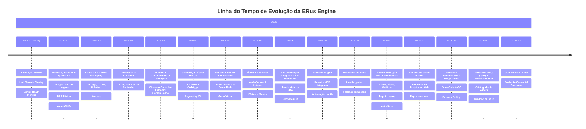

# 🗺️ Roadmap de Versões da ERus Engine

Este documento define a linha do tempo estratégica e o escopo de funcionalidades planejadas para a evolução da **ERus Engine & Editor**, partindo da versão atual até o lançamento da **v1.0.0 (Gold Release)**.

> ⚠️ **Nota sobre prazos:** as versões abaixo representam ordem de dependência e escopo, não um cronograma fixo. Cada marco listado equivale, historicamente, a meses de trabalho em engines maduras com equipes maiores — os prazos devem ser tratados como direção, não compromisso.

---

---

## 📦 Detalhamento dos Marcos de Versão

### 🟢 **v0.5.21 (Atual - Concluído)**
- ✅ **Rede 2.0 & Co-Criação:** Sincronização de arrasto de gizmo em tempo real, presença de desenvolvedores, bounding boxes coloridas e team chat integrado.
- ✅ **Hub Remote Sharing:** Publicação de projetos locais no servidor remoto e convite imediato de membros da equipe.
- ✅ **Server Health Monitor:** Medição assíncrona de Ping e indicadores visuais de status dos servidores remotos.
- ⚠️ **Risco conhecido:** topologia P2P ainda sem host migration — endereçado explicitamente em **v0.6.10**.

---

### 🎨 **v0.5.30: Materiais, Texturas & Sprites 2D**
- 🖌️ **`MaterialComponent` no Inspector:** Cor Base (Color Tint), slot de Albedo Texture, Tiling e Offset.
- 🖼️ **Drag-and-Drop de Imagens:** Arrastar arquivos `.png`/`.jpg` da janela *Project* diretamente para os slots de material e entidades.
- 👁️ **Miniaturas e Preview:** Visualização gráfica de imagens e texturas no navegador de arquivos da engine.
- 🌐 **Sincronização de Texturas:** Replicação automática de novos arquivos de imagem para parceiros conectados na rede.
- 🆔 **Formato de Referência de Asset:** Definir agora (GUID estável por asset, não path) o esquema que materiais, prefabs, áudio e animações vão usar para referenciar arquivos — decisão que fica cara de migrar depois que v0.9.00 (Asset Bundling) já estiver em produção.
- 🌐 **Estratégia de Rede:** texturas sincronizam via canal de asset (TCP) já existente; definir se o preview/thumbnail é gerado local ou replicado.

---

### 🔲 **v0.5.40: Canvas 2D & Sistema de UI de Gameplay**
- 📐 **`CanvasComponent`:** Gerenciador de resolução, escala adaptativa (*Screen Space Overlay* e *World Space*).
- 🖼️ **`UIImageComponent`:** Exibição de texturas e sprites 2D para barras de vida, miras, ícones e inventários.
- 🔤 **`UITextComponent`:** Renderização de fontes TrueType (`.ttf`/SDF) com cores, alinhamentos e sombras.
- 🔘 **`UIButtonComponent`:** Botões interativos com estados *Normal*, *Hover*, *Pressed* e eventos de clique (`OnClick`).
- 📌 **Sistema de Âncoras:** Posicionamento relativo (Top-Left, Center, Stretch, Bottom-Right) responsivo a qualquer resolução.
- 🌐 **Estratégia de Rede:** decidir se estado de UI (ex: texto de um `UIText` alterado por script) é replicado em tempo real entre colaboradores ou é local-only por padrão.

---

### 💡 **v0.5.50: Iluminação & Ambiente**
*(escopo reduzido — separado do antigo v0.5.50 para caber em um ciclo de release realista; prefabs e componentes de gameplay foram para v0.5.55)*
- 💡 **Sistema de Iluminação 3D:**
  - `LightComponent` com suporte a **Directional Light** (Sol), **Point Light** (Lâmpada/Tocha) e **Spot Light** (Lanterna) com cor, intensidade e atenuação de raio.
- 🌫️ **Ambiente, Neblina & Efeitos:**
  - `SkyboxComponent` / `EnvironmentComponent` (fundo com gradiente ou cubemap 360°).
  - `FogComponent` / **Neblina Atmosférica 3D** (Distance Fog linear e exponencial com cor e densidade ajustáveis para profundidade de cena).
  - `ParticleEmitterComponent` (sistema básico de partículas para fogo, fumaça, faíscas e poeira).
- 📦 **Menu de Criação Rápida & Add Component:**
  - Menu `GameObject -> Light / Effects / 3D Object` com objetos pré-configurados prontos.
  - Janela de busca *"Add Component"* com categorias organizadas no Inspector.
- 🌐 **Estratégia de Rede:** propriedades de luz/neblina editadas ao vivo entram no mesmo canal de Temporal Locking do Transform, ou ficam fora do live-sync e só sincronizam no save?

---

### 🧱 **v0.5.55: Prefabs & Componentes de Gameplay**
- 🧱 **Sistema de Prefabs Reutilizáveis (`.prefab`):**
  - Salvar qualquer entidade com seus filhos e componentes configurados como um arquivo `.prefab` no navegador de arquivos.
  - Arrastar prefabs do navegador direto para a cena ou instanciar via script C# (`Instantiate("Player.prefab", position)`).
  - Usa o esquema de Asset GUID definido em v0.5.30 como referência estável do prefab.
- 🏃‍♂️ **Novos Componentes de Gameplay:**
  - `CharacterControllerComponent` (controlador de movimentação com detecção suave de degraus, inclinação e solo sem deslize físico indesejado).
  - `BillboardComponent` (sprites/ícones 2D que sempre se alinham de frente para a câmera).
  - `CameraFollowComponent` (câmera orbital suave de terceira pessoa com distância ajustável).
- 🌐 **Estratégia de Rede:** instanciação de prefab via `Instantiate()` em runtime precisa propagar para colaboradores/clientes conectados — definir protocolo de spawn replicado antes de v0.5.60 depender disso.

---

### 💥 **v0.5.60: Gameplay & Físicas em C#**
- 🧩 **Pré-requisito de decisão:** confirmar/documentar qual motor de física está por baixo (custom, Bepu, Jitter, etc.) antes de iniciar — `AddForce`, `AddImpulse` e `Raycast` dependem diretamente dessa escolha.
- ⚡ **Callbacks de Colisão nos Scripts:** `OnCollisionEnter`, `OnCollisionExit`, `OnTriggerEnter`, `OnTriggerExit` automáticos em classes `ERusScript`.
- 🎯 **Raycasting em C#:** `Physics.Raycast(ray, out hitInfo, maxDistance)` acessível diretamente nos scripts.
- 🕹️ **Manipulação Dinâmica:** Métodos de física (`AddForce`, `AddImpulse`, controle de velocidade linear/angular).
- 🌐 **Estratégia de Rede:** simulação física roda em todos os peers (determinística) ou só no host/autoridade, com correção de estado nos clientes?

---

### 🎬 **v0.5.70: Animator Controller & Sistema Avançado de Animações**
- 🧠 **Máquina de Estados de Animação (Estilo Mecanim):**
  - **Parâmetros de Animação:** `SetFloat`, `SetBool`, `SetTrigger` e `SetInt` para controle direto via script.
  - **Transições com Cross-Fade:** Mesclagem suave de poses (*pose blending*) entre animações sem cortes secos (ex: transição suave de 0.2s de *Idle* para *Run*).
  - **Layers de Animação & Masking:** Suporte a camadas (ex: tocar animação de *Recarregar* apenas na parte superior do corpo enquanto o personagem corre).
- 🎛️ **Janela de Grafo de Animações no Editor (`Animator Window`):**
  - Editor visual baseado em nós com criação de estados, conexões e setas de transição interativas no ImGui.
- 🔔 **Animation Events:**
  - Disparo de eventos e métodos C# em frames específicos da animação.
- 🌐 **Estratégia de Rede:** parâmetros do Animator (`SetTrigger`, etc.) precisam replicar para que outros clientes vejam a mesma animação — definir se via RPC leve ou snapshot de estado.

---

### 🔊 **v0.5.80: Sistema de Áudio 3D Espacial**
- 🎧 **Componentes de Som:** `AudioSourceComponent` e `AudioListenerComponent`.
- 🎵 **Formatos Suportados:** Decodificação e reprodução de `.wav`, `.ogg` e `.mp3`.
- 🌐 **Atenuação Espacial:** Atenuação de volume por distância 3D (*Spatial Blend* 2D/3D, curvas de atenuação).
- 📜 **API de Áudio nos Scripts:** `audioSource.Play()`, `Pause()`, `PlayOneShot(clip)`.
- 🌐 **Estratégia de Rede:** `PlayOneShot` disparado por script replica como evento (RPC) para outros clientes ouvirem o mesmo som, ou é local-only por padrão?

---

### 📖 **v0.5.90: Documentação Integrada & API Reference**
- 📚 **Janela `Help -> Scripting API Reference` no Editor:**
  - Janela acoplável no ImGui com busca instantânea de métodos e classes (`Transform`, `Input`, `Physics`, `Network`, `ECS`).
  - Snippets de código C# com exemplos práticos e botão de cópia com 1 clique (*"Copy Code"*).
- 📝 **Templates Inteligentes de Scripts C#:**
  - Ao clicar em `Create -> C# Script` no navegador de arquivos, o arquivo gerado já vem com exemplos comentados de movimentação, leitura de input, detecção de colisões e busca de componentes.
- 🌐 **Aba "Learn / Documentação" no ERus Hub:**
  - Seção dedicada no launcher com guias de início rápido, manuais em Markdown e links diretos para a documentação offline da engine.

---

### 🤖 **v0.6.00: AI-Native Engine & Servidor MCP**
- 🧠 **Servidor MCP Integrado:** Protocolo Model Context Protocol nativo (HTTP/SSE + Stdio Bridge).
- 🛠️ **Ferramentas de IA:** Inspeção de cenas, criação de entidades, ajuste de materiais, Play Mode e diagnóstico de logs do console.
- 🛡️ **Segurança & Estabilidade:** Session Token contra *DNS Rebinding*, Time-Budgeting de 4ms (anti-freeze) e respeito ao *Temporal Locking*.

---

### 🌐 **v0.6.10: Resiliência de Rede — Host Migration & Fallback**
*(novo marco — endereça explicitamente o risco de topologia P2P sem migração de host, já anotado desde v0.5.21)*
- 🔁 **Host Migration:** eleição de novo host quando o atual desconecta, sem derrubar a sessão colaborativa.
- 💾 **Fallback de Sessão:** reconexão automática de clientes e reconciliação de estado (Temporal Locking) após a migração.
- 🧪 **Cenário de Teste:** queda simulada do host durante edição concorrente para validar reconciliação sem perda de dados.

---

### ⚙️ **v0.6.50: Project Settings & Editor Preferences**
- 🎮 **Janela `Edit -> Project Settings...` (`ProjectSettings.json` salvo no projeto):**
  - **Player:** Nome do Jogo, Versão (`1.0.0`), Nome da Empresa, Ícone do Jogo e **Cena Inicial Padrão (`Startup Scene`)**.
  - **Physics:** Gravidade global (X, Y, Z), *Fixed Timestep* configurável (50Hz / 60Hz / custom) e atrito padrão.
  - **Graphics:** VSync (On/Off), Limite de Taxa de Quadros (Max FPS), Anti-Aliasing (MSAA) e Cor de Fundo Padrão.
  - **Network:** Tick rate de replicação padrão (30Hz), timeout de desconexão e porta padrão do servidor.
  - **Tags & Layers:** Gerenciador visual de Tags personalizadas e Matriz de Colisão entre Layers.
- 🛠️ **Janela `Edit -> Preferences...` (`EditorPrefs.json` salvo em AppData):**
  - **Scene View Camera:** Velocidade da câmera de voo (*Camera Speed*), sensibilidade do mouse e inversão de eixo.
  - **IDE Externa:** Escolha do editor de código padrão (VS Code, Visual Studio 2022, Rider) ao abrir scripts C#.
  - **Auto-Save:** Intervalo de salvamento automático da cena em segundo plano.
  - **Customização da Viewport:** Cor, opacidade e espaçamento do grid 3D.

---

### 🚀 **v0.7.00: Standalone Game Builder & Templates de Projeto**
- 🎮 **Exportador Standalone ("Build Game"):** Gerar pasta com o `.exe` final do jogo empacotado e otimizado utilizando as configurações definidas no *Project Settings*.
- 📦 **Templates no Hub:** Criação rápida com templates *Blank*, *3D FPS/Third-Person Starter* e *Multiplayer Arena*.
- 🔍 **Auto-Detecção de Engines:** Varredura e cadastro automático de versões compiladas localmente no Hub.

---

### 📊 **v0.8.00: Profiler de Performance & Diagnósticos**
- 📈 **Janela `Window -> Profiler` no Editor:**
  - Gráfico em tempo real de frametime (CPU ms vs GPU ms).
  - Breakdown detalhado por subsistemas ECS (Física, Animação, Render, Scripts).
  - Contador de Draw Calls, contagem de Triângulos/Vértices e monitor de alocação de memória RAM e GC (`Garbage Collector`).
- 👁️ **Frustum Culling Avançado:**
  - Descarte automático de objetos fora do campo de visão da câmera para máxima taxa de quadros (FPS) em cenas grandes.

---

### 📦 **v0.9.00: Asset Bundling (`.pak`), Criptografia & Multiplataforma**
- 🔒 **Empacotamento de Assets (`.pak` / `.data`):**
  - Compactação e criptografia de texturas, modelos 3D, sons e cenas em um pacote protegido, impedindo extração não autorizada de assets do jogo final.
  - Reaproveita o esquema de Asset GUID definido em v0.5.30 como chave de empacotamento, evitando migração de referências nesta etapa.
- 🐧 **Suporte Multiplataforma:**
  - Exportação e compilação nativa para **Windows (x64)** e **Linux (x64 / Steam Deck)**.

---

### 🏆 **v1.0.00: Gold Release Oficial (Produção Comercial)**
- 💎 **Estabilidade & Polimento:** Otimizações finais de performance em cenas complexas e partidas multiplayer prolongadas.
- 📚 **Documentação Completa:** Manuais de API, tutoriais passo a passo e documentação de arquitetura finalizada.
- 📦 **Distribuição Oficial:** Pacotes de instalação consolidados.
