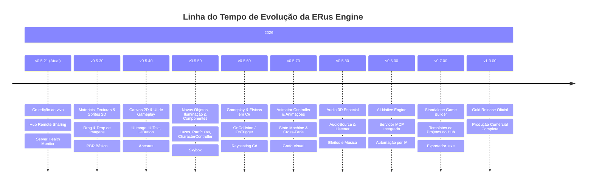

# 🗺️ Roadmap de Versões da ERus Engine

Este documento define a linha do tempo estratégica e o escopo de funcionalidades planejadas para a evolução da **ERus Engine & Editor**, partindo da versão atual até o lançamento da **v1.0.0 (Gold Release)**.

---

---

## 📦 Detalhamento dos Marcos de Versão

### 🟢 **v0.5.21 (Atual - Concluído)**
- ✅ **Rede 2.0 & Co-Criação:** Sincronização de arrasto de gizmo em tempo real, presença de desenvolvedores, bounding boxes coloridas e team chat integrado.
- ✅ **Hub Remote Sharing:** Publicação de projetos locais no servidor remoto e convite imediato de membros da equipe.
- ✅ **Server Health Monitor:** Medição assíncrona de Ping e indicadores visuais de status dos servidores remotos.

---

### 🎨 **v0.5.30: Materiais, Texturas & Sprites 2D**
- 🖌️ **`MaterialComponent` no Inspector:** Cor Base (Color Tint), slot de Albedo Texture, Tiling e Offset.
- 🖼️ **Drag-and-Drop de Imagens:** Arrastar arquivos `.png`/`.jpg` da janela *Project* diretamente para os slots de material e entidades.
- 👁️ **Miniaturas e Preview:** Visualização gráfica de imagens e texturas no navegador de arquivos da engine.
- 🌐 **Sincronização de Texturas:** Replicação automática de novos arquivos de imagem para parceiros conectados na rede.

---

### 🔲 **v0.5.40: Canvas 2D & Sistema de UI de Gameplay**
- 📐 **`CanvasComponent`:** Gerenciador de resolução, escala adaptativa (*Screen Space Overlay* e *World Space*).
- 🖼️ **`UIImageComponent`:** Exibição de texturas e sprites 2D para barras de vida, miras, ícones e inventários.
- 🔤 **`UITextComponent`:** Renderização de fontes TrueType (`.ttf`/SDF) com cores, alinhamentos e sombras.
- 🔘 **`UIButtonComponent`:** Botões interativos com estados *Normal*, *Hover*, *Pressed* e eventos de clique (`OnClick`).
- 📌 **Sistema de Âncoras:** Posicionamento relativo (Top-Left, Center, Stretch, Bottom-Right) responsivo a qualquer resolução.

---

### 💡 **v0.5.50: Novos Objetos, Iluminação & Componentes ECS**
- 💡 **Sistema de Iluminação 3D:**
  - `LightComponent` com suporte a **Directional Light** (Sol), **Point Light** (Lâmpada/Tocha) e **Spot Light** (Lanterna) com cor, intensidade e atenuação de raio.
- 🌫️ **Ambiente & Efeitos:**
  - `SkyboxComponent` / `EnvironmentComponent` (fundo com gradiente ou cubemap 360°).
  - `ParticleEmitterComponent` (sistema básico de partículas para fogo, fumaça, faíscas e poeira).
- 🏃‍♂️ **Novos Componentes de Gameplay:**
  - `CharacterControllerComponent` (controlador de movimentação com detecção suave de degraus, inclinação e solo sem deslize físico indesejado).
  - `BillboardComponent` (sprites/ícones 2D que sempre se alinham de frente para a câmera).
  - `CameraFollowComponent` (câmera orbital suave de terceira pessoa com distância ajustável).
- 📦 **Menu de Criação Rápida & Add Component:**
  - Menu `GameObject -> Light / Effects / Gameplay / 3D Object` com objetos pré-configurados prontos.
  - Janela de busca *"Add Component"* com categorias organizadas no Inspector.

---

### 💥 **v0.5.60: Gameplay & Físicas em C#**
- ⚡ **Callbacks de Colisão nos Scripts:** `OnCollisionEnter`, `OnCollisionExit`, `OnTriggerEnter`, `OnTriggerExit` automáticos em classes `ERusScript`.
- 🎯 **Raycasting em C#:** `Physics.Raycast(ray, out hitInfo, maxDistance)` acessível diretamente nos scripts.
- 🕹️ **Manipulação Dinâmica:** Métodos de física (`AddForce`, `AddImpulse`, controle de velocidade linear/angular).

---

### 🎬 **v0.5.70: Animator Controller & Sistema Avançado de Animações**
- 🧠 **Máquina de Estados de Animação (Estilo Mecanim):**
  - **Parâmetros de Animação:** `SetFloat`, `SetBool`, `SetTrigger` e `SetInt` para controle direto via script.
  - **Transições com Cross-Fade:** Mesclagem suave de poses (*pose blending*) entre animações sem cortes secos (ex: transição suave de 0.2s de *Idle* para *Run*).
  - **Layers de Animação & Masking:** Suporte a camadas (ex: tocar animação de *Recarregar* apenas na parte superior do corpo enquanto o personagem corre).
- 🎛️ **Janela de Grafo de Animações no Editor (`Animator Window`):**
  - Editor visual baseado em nós com criação de estados, conexões e setas de transição interativas no ImGui.
- 🔔 **Animation Events:**
  - Disparo de eventos e métodos C# em frames específicos da animação.

---

### 🔊 **v0.5.80: Sistema de Áudio 3D Espacial**
- 🎧 **Componentes de Som:** `AudioSourceComponent` e `AudioListenerComponent`.
- 🎵 **Formatos Suportados:** Decodificação e reprodução de `.wav`, `.ogg` e `.mp3`.
- 🌐 **Atenuação Espacial:** Atenuação de volume por distância 3D (*Spatial Blend* 2D/3D, curvas de atenuação).
- 📜 **API de Áudio nos Scripts:** `audioSource.Play()`, `Pause()`, `PlayOneShot(clip)`.

---

### 🤖 **v0.6.0: AI-Native Engine & Servidor MCP**
- 🧠 **Servidor MCP Integrado:** Protocolo Model Context Protocol nativo (HTTP/SSE + Stdio Bridge).
- 🛠️ **Ferramentas de IA:** Inspeção de cenas, criação de entidades, ajuste de materiais, Play Mode e diagnóstico de logs do console.
- 🛡️ **Segurança & Estabilidade:** Session Token contra *DNS Rebinding*, Time-Budgeting de 4ms (anti-freeze) e respeito ao *Temporal Locking*.

---

### 🚀 **v0.7.0: Game Builder & Templates de Projeto**
- 🎮 **Exportador Standalone ("Build Game"):** Gerar pasta com o `.exe` final do jogo empacotado e otimizado (sem o editor).
- 📦 **Templates no Hub:** Criação rápida com templates *Blank*, *3D FPS/Third-Person Starter* e *Multiplayer Arena*.
- 🔍 **Auto-Detecção de Engines:** Varredura e cadastro automático de versões compiladas localmente no Hub.

---

### 🏆 **v1.0.0: Gold Release Oficial (Produção Comercial)**
- 💎 **Estabilidade & Polimento:** Otimizações finais de performance em cenas complexas e partidas multiplayer prolongadas.
- 📚 **Documentação Completa:** Manuais de API, tutoriais passo a passo e documentação de arquitetura finalizada.
- 📦 **Distribuição Oficial:** Pacotes de instalação consolidados.
